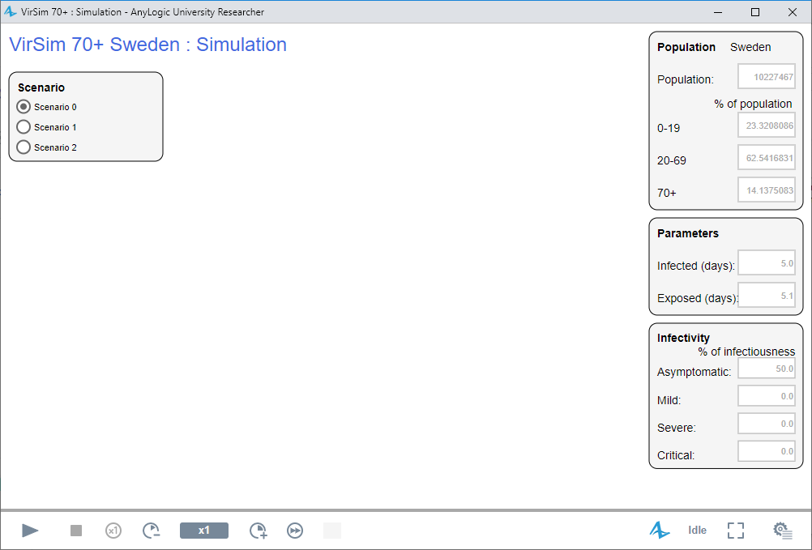
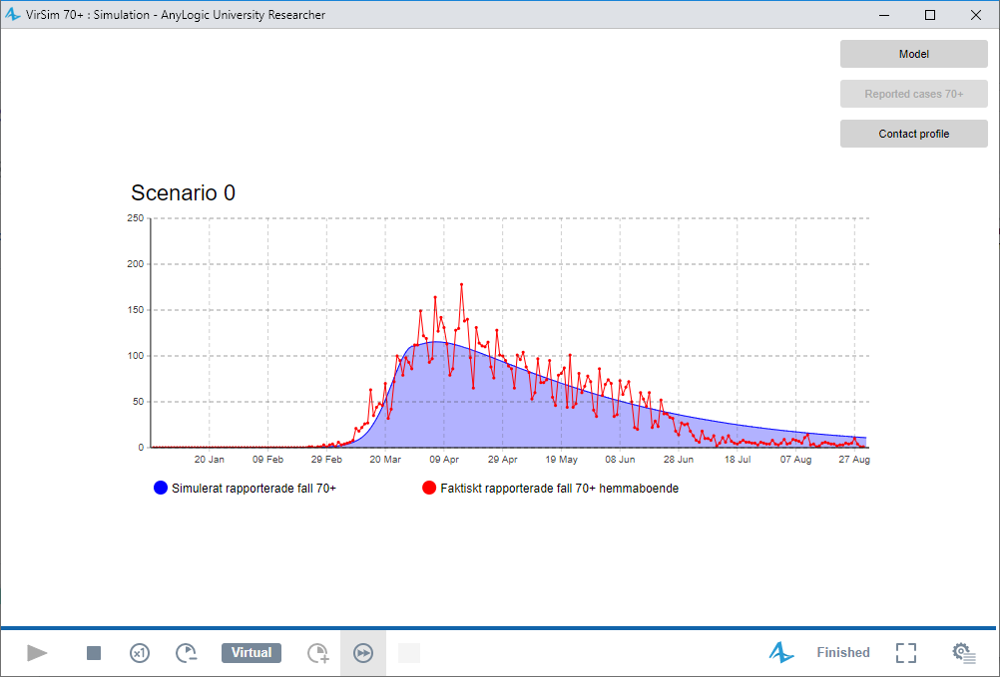
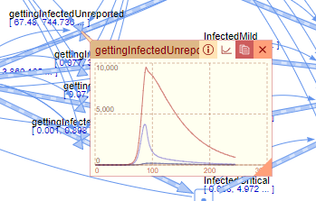
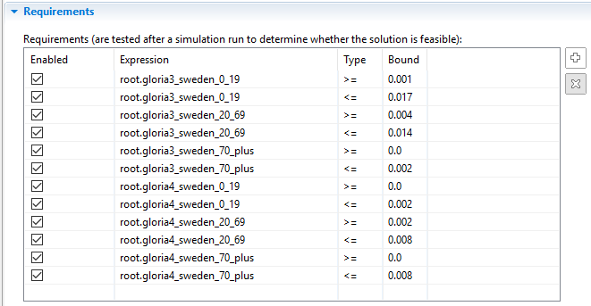

# VirSim
VirSim is a compartmental SEIR (Susceptible, Exposed, Infected, Recovered) model, divided into three age-groups 0-19, 20-69, and 70+. The model is developed to simulate three scenarios part of the project "Konsekvenser för personer 70 år och äldre av smittskyddsåtgärder mot covid-19". More about these scenarios can be found [here](https://www.folkhalsomyndigheten.se/publicerat-material/publikationsarkiv/k/konsekvenser-for-personer-70-ar-och-aldre-av-smittskyddsatgarder-mot-covid-19/?pub=81272) (in Swedish). 

## Requirements
VirSim is developed in the software [AnyLogic](https://www.anylogic.com/), and version 8.6 or later is required to run the model.

## Folder structure
The model "VirSim 70 plus - Sweden.alp" is found in the sub-folder "model", the number of reported cases per day are found in the sub-folder "data". The folder "figures" is used to store the figures used in this documentation.

## Model structure
The model consists of three parts:
* Main: is the simulation model and related functionality  
* Simulation: is used for starting the simulations  
* Optimization: is used to fit the model against reported cases (excluding healthcare workers and extended testing) in Sweden.

# Running the simulations
To run the simulations, click on the black triangle next to the green play button in the toolbar, and select "VirSim 70 plus - Sweden / Simulation". In the window that opens, choose a scenario, and click on the gray play button in the lower-left of the window, see Figure 1 below.  

*Figure 1. The simulation GUI.*

## Exporting data
To export data, click on the "Model" button to open the model view area (Figure 2). Then click on the stock (compartment) or flow you want to export. In the pop-up window, click on the graph button and then on the copy button (Figure 3).

  
*Figure 2. The main model GUI.*  

  
*Figure 3. Export data*  

# Running the optimizations
To fit the model against the daily reported cases, click on the black triangle next to the green play button in the toolbar, then select VirSim 70 plus - Sweden / Optimization. In the window that opens, click on the gray play button in the lower-left of the optimization window. The optimization experiment estimates the infectivity, contact reduction, and the proportion of unreported cases in each age-group.

During the spring of 2020, two prevalence studies were conducted in Sweden, Gloria 3 (21/4 - 24/4), and Gloria 4 (25/5 - 28/5). To estimate the proportion of unreported cases in each age-group (0-19, 20-69, 70+), we used these prevalences as "requirements" in the optimization, i.e., requirements which a feasible solution had to fulfill, see Figure 4.

  
*Figure 4. The requirements section of the optimization experiment.*